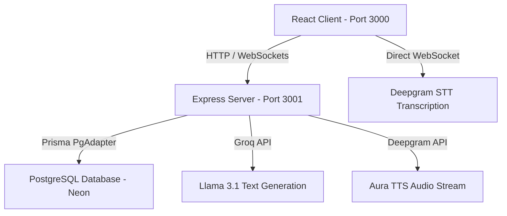

# SignalForge 🚀

**SignalForge** is a state-of-the-art, voice-driven AI technical interviewer platform. It allows software engineers and candidates to undergo realistic, conversational, and highly personalized technical mock interviews tailored directly to their target job descriptions, resumes, or GitHub portfolios. 

At the end of the session, candidates receive an interactive scorecard with structured technical feedback and a performance score out of 10.

---

## Key Capabilities & Features

*   🎙️  **Hybrid Voice Architecture**:
    *   **Mode A (WebRTC Realtime)**: Seamless, ultra-low latency streaming using the OpenAI Realtime API.
    *   **Mode B (Fallback High-Fidelity Voice)**: Zero OpenAI credit requirement! Leverages **Deepgram Aura TTS** for natural human speaking voices, **Deepgram WebSocket STT** for accurate real-time transcription, and **Groq (Llama 3.1)** for fast, intelligent conversational reasoning.
*   ⏳  **Voice Speed Customization**: Utilizes browser-native audio playback rates (`defaultPlaybackRate = 0.92`) to deliver natural, slower-paced, and highly comprehensible speech.
*   📄  **Resume PDF Parsing**: High-premium drag-and-drop upload zone that extracts text contents directly on the client side using **PDF.js**, populating the background fields instantly.
*   👤  **Candidate Personalization**: Adapts questions dynamically to the candidate's name, tech stack, and target job description/role.
*   🎛️  **Real-Time Audio Visualizer**: Pulsates voice indicators/orbs dynamically to match the candidate's microphone input volume and the interviewer's generated speech frequencies.
*   ⏱️  **Countdown Dashboard Timer**: Features an interactive 20-minute countdown widget. When the time limit is near, the system injects wrap-up instructions into the LLM context to wind down the conversation gracefully before auto-ending.

---

## System Architecture

SignalForge is managed as a monorepo workspace powered by **Turborepo** and **Bun**:



*   **Frontend (`apps/frontend`)**: Built with React, Lucide Icons, and Vanilla Tailwind. Parsed files run inside browser AudioContext/Analyser Nodes.
*   **Backend (`apps/backend`)**: Node/Express server serving configuration status, local session state, and streaming audio piping.
*   **Database**: PostgreSQL hosted on **Neon**, mapped through **Prisma ORM**.

---

## Configuration & Environment Variables

Create a `.env` file in the `apps/backend/` directory. You can use `apps/backend/.env.example` as a template:

```env
# Database Connection
DATABASE_URL="postgresql://<user>:<password>@<host>/<database>?sslmode=require"

# Speech Synthesis & Transcription (Required for fallback mode)
# Register at: https://console.deepgram.com/
DEEPGRAM_API_KEY="your-deepgram-api-key"

# Large Language Model (Required for text generation & evaluation)
# Register at: https://console.groq.com/
GROQ_API_KEY="your-groq-api-key"
GROQ_MODEL="llama-3.1-8b-instant"

# Optional: OpenAI Key (For WebRTC Realtime API Mode)
# Register at: https://platform.openai.com/
OPENAI_KEY=""
```

---

## Setup & Running Locally

Ensure you have **Bun** installed globally on your machine (`npm install -g bun` or `curl -fsSL https://bun.sh/install | bash`).

### 1. Install Dependencies
From the root directory, run:
```bash
bun install
```

### 2. Configure Database Schema
Prisma client generation and DB migration are automated. Sync your Neon database:
```bash
cd apps/backend
bunx prisma db push
bunx prisma generate
cd ../..
```

### 3. Launch Development Servers
Run the concurrent dev command from the root workspace:
```bash
bun run dev
```

This commands launches:
*   The React Frontend at: `http://localhost:3000`
*   The Express Backend at: `http://localhost:3001`

---

## Production Build

To compile TypeScript and bundle the frontend distribution files:
```bash
bun run build
```
The static build assets will be generated inside `apps/frontend/dist/`.